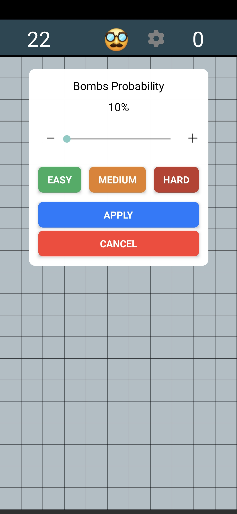
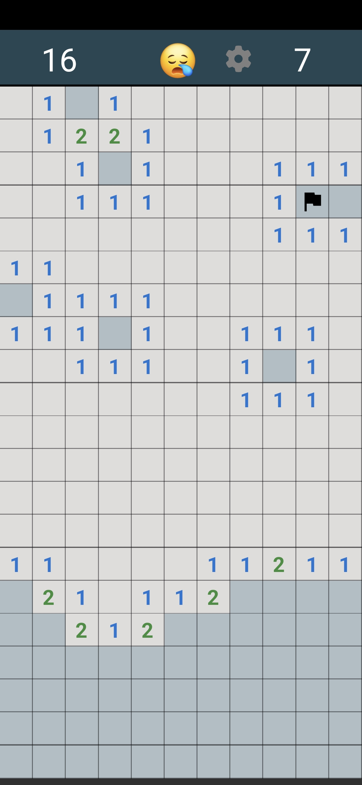

# 💣 Minesweeper

A clean and modern implementation of the classic **Minesweeper** game built with **React Native**. Designed for mobile devices, this version brings intuitive controls, dynamic difficulty, haptic feedback, and a minimalist UI.

---

## 📱 Features

- 🎮 Classic Minesweeper gameplay
- 🔥 Adjustable difficulty (Easy / Medium / Hard)
- 📏 Responsive grid based on screen size
- 💥 Haptic feedback on actions
- 🎨 Flat design with emoji-based feedback
- ⚙️ Settings menu to control bomb frequency
- ⏱️ Game timer and bomb counter
- ✅ Long-press to flag a cell
- ☁️ Persistent state across app launches

---

## Privacy Policy

This app does not collect any personal data. All game settings and states are stored locally on your device. For more details, please refer to our [Privacy Policy](PRIVACY.md).

## Contributing

Contributions are welcome! If you have suggestions or improvements, please open an issue or submit a pull request.

